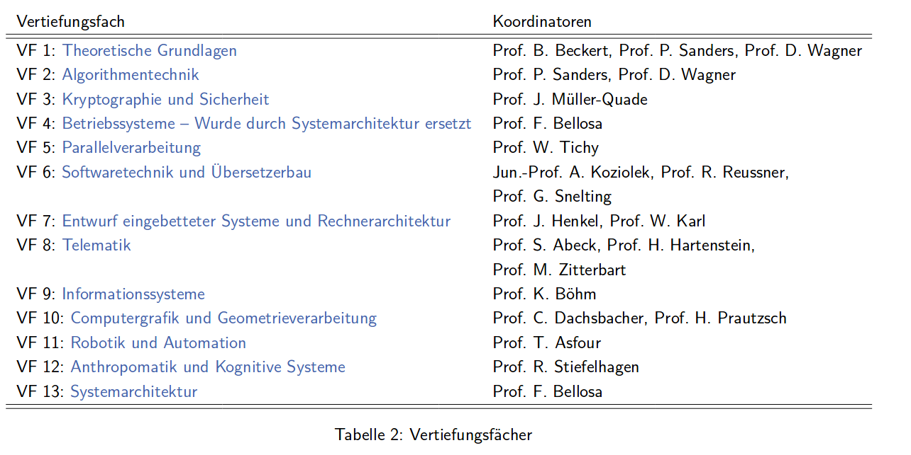
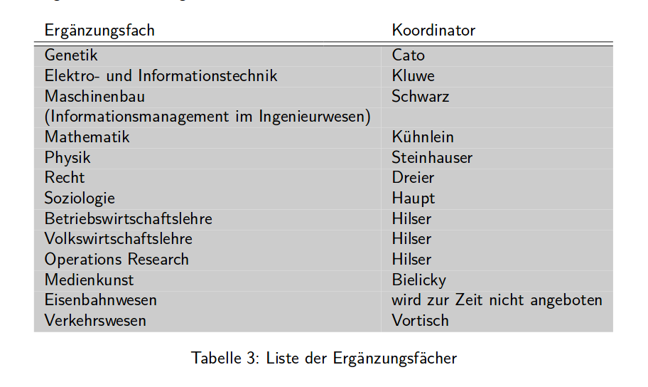

Dieser Artikel beschreibt, wie man sich den Master Informatik nach SPO-2015 zusammenstellen kann.
Wenn du diesen Artikel durchgelesen hast, dann weißt du, wie der Master strukturiert ist
und worauf du achten musst.

Alle Informationen sind folgenden Quellen zu entnehmen:

 - [Alle Formulare Informatik](https://www.informatik.kit.edu/formulare.php)
 - [Modulhandbuch WS 2018/19](cs-k.it/modul)
 - [Wiki Informatik](cs-k.it/wiki)

## Struktur

Der Master soll vier Semester dauern. Das grobe Gerüst sieht wie folgt aus:

Es gibt sechs Bereiche im Masterstudium:

 - Stammmodule: Man muss vier von ihnen wählen (In unterschiedliche Gebiete schnuppern/einsteigen)
 - Zwei Vertiefungsfächer (vermutlich zusammenhängende Vorlesungen mit Seminar und Praktikum)
 - Wahlbereich: Alles, was man sonst so belegen kann aus der Informatik
 - Ergänzungsfach: Vorlesungen aus Anwendungsgebieten (Mathe, Physik, ...)
 - Überfachliche Qualifikation (Soft-Skills, Sprachen...)
 - Masterarbeit

### Arbeitsaufwand

Man arbeitet am KIT für LP (Leistungspunkte). Auf Englisch sind das ECTS.

Das Modulhandbuch sagt:

      "Dabei entspricht ein Leistungspunkt einem Aufwand von
      ca. 30 Arbeitsstunden für einen durchschnittlichen Studierenden."

**Nachgerechnet:**
Eine Vorlesung mit 6 LP hat also 180 Arbeitsstunden. Das Wintersemester besteht aus 12 Wochen,
das heißt eine 6-LP-Wochenstunde hat 15 Wochenarbeitsstunden.  
=> Bei 30 LP im Wintersemester wären das 75 Wochenstunden
*(Hoffentlich ist da ein Rechenfehler drin!)*

      Beispiel Zusammensetzung der Stunden für Algorithmen II:
      6 LP entspricht ca. 180 Stunden
      ca. 45 Std. Vorlesungsbesuch,
      ca. 15 Std. Übungsbesuch,
      ca. 90 Std. Nachbearbeitung und Bearbeitung der Übungsblätter
      ca. 30 Std. Prüfungsvorbereitung

### Prüfungen wiederholen

Das Modulhandbuch sagt:

      "Jede Prüfung kann einmal wiederholt werden".

Meiner Interpretation nach ist das nicht abhängig davon, ob man durchgefallen ist
oder nur einen Verbesserungsversuch schreiben möchte.

Eine "Mülltonnenregelung" wie an der LMU gibt es wohl nicht. Da konnte man die
schlechtesten Ergebnisse nicht in den Schnitt einberechnen lassen.

**Bei zweimaligem Nicht-Bestehen: Exmatrikulation und Prüfungsanspruchsverlust**

Modulhandbuch:

      "Grundsätzlich kann jede Erfolgskontrolle (mündlicher, schriftlicher oder anderer Art) einmal wiederholt werden. Im Falle
      einer schriftlichen Prüfung erfolgt nach zweimaligem Nichtbestehen zeitnah (in der Regel im selben Prüfungszeitraum)
      eine mündliche Nachprüfung. In dieser können nur noch die Noten “ausreichend” (4,0) oder “nicht ausreichend” (5,0)
      vergeben werden. Ist eine Prüfung endgültig nicht bestanden, so gilt der Prüfungsanspruch im Fach Informatik und für alle
      artverwandten Studiengänge als verloren. Eine Teilnahme an weiteren Prüfungen ist nicht möglich. Durch Genehmigung
      eines Antrags auf Zweitwiederholung können weitere Prüfungen unter Vorbehalt (http://www.informatik.kit.edu/faq-
      info.php) abgelegt werden. Der Studierende bekommt diese aber im Erfolgsfall erst angerechnet, wenn die endgültig nicht
      bestandene Prüfung bestanden wurde. Der Prüfungsanspruch gilt erst dann als wiederhergestellt, wenn die nicht bestandene
      Prüfung bestanden ist. Studienleistungen (unbenotete Erfolgskontrolle) können beliebig wiederholt werden, falls in der
      Modul- oder Teillleistungsbeschreibung keine weiteren Regelungen vorgesehen sind. Der Zweitwiederholungsantrag ist bei
      dem Informatik Studiengangservice (ISS) schriftlich einzureichen."

**Abmeldung von Klausuren**

      "Danach ist ohne Angabe von Gründen bis zur Ausgabe der Prüfungsaufgaben bei schriftlichen Prüfungen eine Abmeldung
      (persönlich und schriftlich) nur noch direkt beim zuständigen Prüfer möglich. Die Abmeldung von einer mündlichen Prüfung
      erfolgt beim zuständigen Prüfer bzw. seinem Sekretariat. Die Abmeldung muss spätestens drei Werktage vor dem
      Prüfungstermin erklärt werden. Ein persönliches Erscheinen kann für die Abmeldung verlangt werden. "

Siehe auch im [Wiki zu Prüfungen](https://www.informatik.kit.edu/faq-wiki/doku.php?id=pruefungen)

### Verlorene LP

Vorlesungen, Seminare und Praktika können zu **Modulen** gruppiert werden.
Wenn man mehr LP als nötig in einem Modul hat, dann werden die überschüssigen
einfach abgeschnitten. In die Notenberechnung fließt die Leistung dennoch ein.

Das heißt mehr Arbeit für eine minimale Verbesserungschance.

      "Werden durch die belegten Studien- und Prüfungsleistungen in einem Modul mehr LP
       als dem Modul zugeordnet sind erreicht, so werden die überschüssigen LP auf die
       Modulgröße abgeschnitten. Die Note des Moduls berechnet sich mit Berücksichtigung
      aller im Modul erbrachten LP."

Siehe hierzu:

 - [LP Verschnitt im Wiki](https://www.informatik.kit.edu/faq-wiki/doku.php?id=lp-verschnitt)
 - [Notenberechnung im Wiki](https://www.informatik.kit.edu/faq-wiki/doku.php?id=notenberechnung)

## Stammmodule

Laut Modulhandbuch: "Stammmodule vermitteln erweiterte Grundlagen aus sehr spezifischen Bereichen der Informatik."

**Im Wintersemester gibt es andere Stammmodule als im Sommersemester.**

**Überlegung:** Wenn man im ersten Semester die vier Stammmodule belegt, dann kommt man bereits auf
4x6 ECTS = 24 ECTS. Dann hat man sich noch nicht für ein Profil oder Vertiefungsfach
entschieden und kann quasi noch abwarten, welche Vorlesung einem am besten gefällt.

## Vertiefungsfächer

Wähle zwei Vertiefungsfächer (á 15 - 52 LP) aus der folgenden Liste:

      "Für Studierende, die nach der SPO 2015 studieren, gilt außerdem: In jedem Vertiefungsfach müssen mind. 10 LP aus
      Vorlesungen (keine Stammvorlesungen) erbracht werden. Ausnahme bildet VF8 Telematik: Im VF Telematik müssen mind. 8 LP aus Vorlesungen (keine Stammvorlesung) erbracht werden. Anstelle mehrerer mündlicher Prüfungen zu Modulen eines
      Vertiefungsfachs kann eine modulübergreifende Prüfung zu diesen Modulen durchgeführt werden. Darüber entscheidet
      der/die Prüfer/in.
      Insgesamt können in einem Vertiefungsfach bis zu 52 LP erbracht werden, jedoch können insgesamt im Studium nicht
      mehr als 120 LP absolviert werden."

**ACHTUNG! 12-18 LP durch Vertiefungsfächer und Wahlbereich. Mindestens 3 LP Seminare. Mindestens 6 LP Praktika.**

      "Für Studierende, die nach der SPO 2015 studieren, gilt: Es müssen mind. 3 LP durch Seminare und mind. 6 LP durch
      Praktika in den Vertiefungsfächern und dem Wahlbereich erbracht werden. Insgesamt müssen mind. 12 LP durch Praktika
      und Seminare erbracht werden (s. auch. Abbildung 1).
      Für alle Studierenden gilt: Es dürfen insgesamt max. 18 LP durch Praktika und Seminare erbracht werden."

## Wahlbereich

Der Rest an Leistungspunkten wird durch Veranstaltungen aus dem Wahlbereich aufgefüllt (12 - 49 LP):

      "Maximal stehen für den Wahlbereich (SPO 2015) 49 LP zur Verfügung (120 LP
      abzüglich der Pflichtleistungen in den anderen Fächern sowie der Masterarbeit)."

Die Liste aller Veranstaltungen kann dem [Vorlesungsverzeichnis](cs-k.it/vlv)
entnommen werden oder der [Modulhandbuch](cs-k.it/modul).

**ACHTUNG! 12-18 LP durch Vertiefungsfächer und Wahlbereich. Mindestens 3 LP Seminare. Mindestens 6 LP Praktika.**
(Siehe oben)

## Ergänzungsfach

Wähle Module von 9 - 18 LP (SPO 2015) aus Gebieten, in denen die Informatik zur Anwendung kommt.

## Überfachliche Qualifikation

      "Teil des Studiums ist auch der Erwerb von Überfachlichen Qualifikationen
      im Umfang von 2 – 6 Leistungspunkten (SPO 2015). Zu diesem Bereich zählen
      überfachliche Veranstaltungen zu gesellschaftlichen Themen,
      fachwissenschaftliche Ergänzungsangebote, welche die Anwendung des Fachwissens
      im Arbeitsalltag vermitteln, Kompetenztrainings zur gezielten Schulung von
       Soft Skills sowie Fremdsprachentrainings."

Besuche Veranstaltungen von folgenden Organisationen (2-6 LP). Die Note der Veranstaltung
kann zwar übertragen werden, wird aber nicht in den Schnitt miteinberechnet.

- House of Competence (HoC)
- Zentrum für angewandte Kulturwissenschaften (ZAK)
- Sprachenzentrums (SpZ)

## Masterarbeit

Die Masterarbeit macht 30 ECTS aus. Soll in 6 Monaten bearbeitet werden.
Die Präsentation muss innerhalb von vier Wochen nach der Abgabe gehalten werden.
Man kann einmal sein Thema innerhalb von einem Monat nach Erhalt "zurückgeben".

[Allgemeine Informationen zur Masterarbeit im Wiki](https://www.informatik.kit.edu/faq-wiki/doku.php?id=masterarbeit_allg)

## Studienprofile

 Seit dem Wintersemester 2017/18 kann man Profile wählen. Das ist sowas wie eine
 Orientierungshilfe, um sich in eine Richtung zu spezialisieren (kein Mehraufwand).

Es gibt folgende Profile
(siehe [https://www.informatik.kit.edu/9378.php](https://www.informatik.kit.edu/9378.php)):

1. Daten-intensives Rechnen
2. Energieinformatik
3. Internet und Gesellschaft
4. IT-Sicherheit
5. Künstliche Intelligenz
6. Multi-Scale Computing Systems
7. Robotik
8. Software Engineering
9. Visual Computing

Folgende Auszüge aus dem Modulhandbuch sind interessant im Bezug auf die Profile:

**Studienplan am Anfang des Semesters festlegen:**
  *Studierenden, die ein Profil absolvieren möchten, wird stark empfohlen, am Anfang des Studiums einen Studienplan zu
  erstellen. Dafür steht Anlage 1 zur Verfügung (siehe auch http://www.informatik.kit.edu/formulare.php#block1936).
  Der Studienplan kann zur Planungssicherheit im Rahmen einer Beratung beim Informatik Studiengangservice (ISS)
  überprüft werden (http://www.informatik.kit.edu/3724.php). Der ISS überprüft zusammen mit dem/der Studierenden,
  ob die Bedingungen für das Studienprofil und für den Masterstudiengang erfüllt sind.*

**Auswirkungen eines Studienprofils:**
*In der Regel beschränkt ein Studienprofil die thematische Ausrichtung der Masterarbeit und enthält Regelungen
zur Wahl von Modulen im Umfang von mindestens 45 Leistungspunkten. [...] Ein Studienprofil kann Bedingungen aufstellen zu
– dem Themenbereich der Masterarbeit,
– den zu wählenden Vertiefungsfächern,
– dem zu wählenden Ergänzungsfach,
– den innerhalb der Vertiefungsfächer, dem Ergänzungsfach und der Überfachlichen Qualifikationen zu
belegenden Modulen (einschließlich Stammmodulen, Praktika und Seminaren).*
